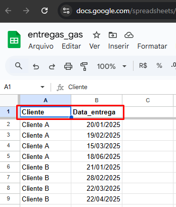
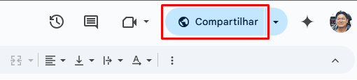
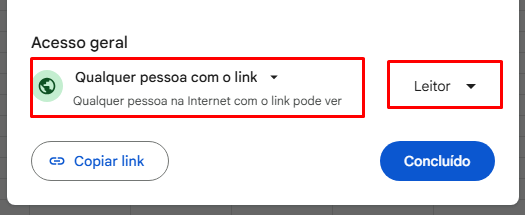

# [SICGAS – Sistema Inteligente de Consumo de Gás](https://digcard.github.io/sicgas/)

SICGAS é um sistema inteligente para entregadores e revendas de gás GLP. Ele permite prever o consumo dos clientes, antecipar entregas, aumentar vendas e fidelizar clientes, tudo de forma simples e automatizada.

> 👉 [visite o site do SICGAS](https://digcard.github.io/sicgas/)

## 🚀 Download do Executável

O executável do SICGAS estará disponível para download diretamente neste repositório, na seção [Releases](../../releases) ou no link abaixo:

> 👉 [Baixar SICGAS para Windows](./SICGAS.exe)

- **Compatível com Windows 10/11**

## 🛠️ Como Usar o SICGAS

1. **Faça o download** do arquivo executável `SICGAS.exe`.
2. **Execute o instalador** e siga as instruções na tela.
3. O sistema irá solicitar a configuração da sua planilha Google para registro dos clientes e entregas.

## 📊 Configuração da Planilha Google

Para que o SICGAS registre e acompanhe os dados dos clientes, é necessário conectar uma planilha Google. Siga os passos abaixo:

1. **Crie uma nova planilha** no Google Sheets com as colunas necessárias exactamente com os seguintes nomes: `Cliente` e `Data_entrega`.

   

2. **Compartilhe a planilha** 

   - 2.1 Abra sua planilha no Google Sheets
      - Acesse https://sheets.google.com e abra a planilha que deseja compartilhar.
   - 2.2 Clique em “Compartilhar” (botão azul no canto superior direito)

      

   - 2.3. Na janela que abrir, clique em “Qualquer pessoa com o link”
Se não aparecer, clique em “Alterar para qualquer pessoa com o link”.
   - 2.4. Altere a permissão para `“Leitor”`
      - Ao lado de “Qualquer pessoa com o link”, clique no menu suspenso (normalmente aparece como “Editor” ou “Leitor”).
      - Selecione Leitor.

      

   - 2.5. Copie o link
      - Clique em “Copiar link”.

3. **No SICGAS**, insira o link da planilha quando solicitado.

4. O sistema irá validar o acesso e começar a registrar automaticamente os dados das entregas e previsões de consumo.

> **Dica:** O próprio programa mostra o passo a passo para conectar sua planilha Google na primeira execução.

## 📞 Suporte

Em caso de dúvidas ou problemas, entre em contato pelo WhatsApp:

[Suporte WhatsApp](https://wa.me/5527988384017?text=Tenho%20d%C3%BAvidas%20sobre%20o%20SICGAS)

## 📢 Contribua

Sugestões, bugs ou melhorias? Abra uma issue ou envie um pull request!

---

**SICGAS – Antecipe-se. Fidelize. Venda mais.**
